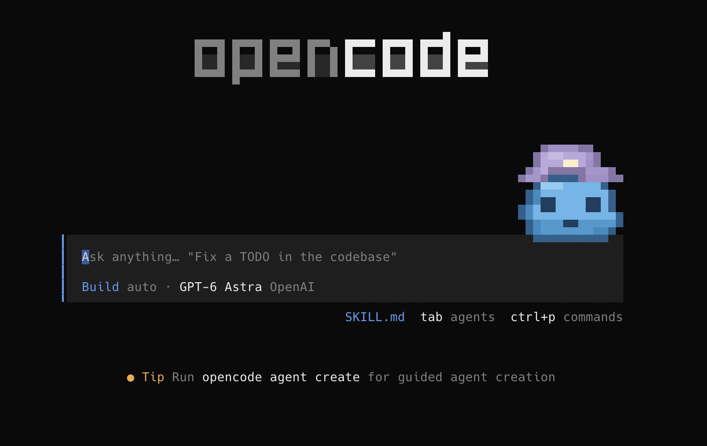

# OpenCode Pals

A native pixel companion that reacts to your OpenCode session.



## Install globally from the repo

Prerequisites: tested with **OpenCode 1.18.30**, **Bun 1.3.13**, and a true-color terminal with half-block glyphs.

```sh
git clone https://github.com/KershSoftware/opencode-pals.git
cd opencode-pals
bun install --frozen-lockfile
bun run build
bun run install:global
```

Quit and restart OpenCode from any project, then open `/pals` → **Pals settings**.

Uninstall from the checkout: `bun run uninstall:global`, then restart OpenCode.

## One-off native testing

From the checkout, save a [candidate module](docs/character-workflow.md#trial-module-contract) as `my-character.ts`:

```sh
bun run try:pal -- ./my-character.ts
```

The trial uses an isolated temporary OpenCode environment. Open `/pals-trial` → **Pals trial mood** to inspect expressions; quit to clean up.

## Agent skills

Load these skills by name in OpenCode, or read their instructions:

- [pals-create-character](.opencode/skills/pals-create-character/SKILL.md) — Create characters, skins, and hats.
- [pals-try-native](.opencode/skills/pals-try-native/SKILL.md) — Try a candidate in native OpenCode.
- [pals-global-setup](.opencode/skills/pals-global-setup/SKILL.md) — Install, update, or uninstall globally.

[Detailed setup and reference](docs/setup.md)
